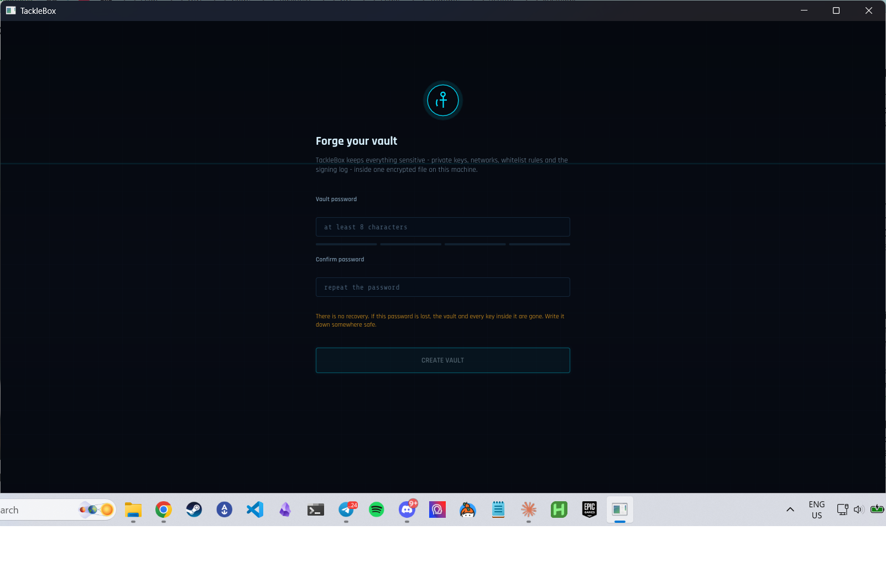

# TackleBox

A native C++ wallet and block explorer for [Antelope](https://antelope.io)
blockchains (EOS/Vaulta, WAX, Telos, and friends) - the toolkit you carry onto
the open sea. Built on [dwarfkit](https://github.com/on-a-t-break/dwarfkit)
(the native port of Greymass' Wharfkit SDK) with a Dear ImGui interface on an
SDL3 shell that spans desktop and mobile.

One binary, one encrypted vault file, no browser, no Electron, no telemetry.
The UI adapts by form factor: full sidebar on desktop, icon rail on tablets,
bottom tab bar + sheet modals on phones - try them anywhere with
`--phone --touch`, `--tablet`, `--desktop`. iOS/Android scaffolds live in
`platform/`; see [docs/MOBILE.md](docs/MOBILE.md) for the honest status.



## What it does

- **Wallet** - hold K1/R1 keys in an encrypted local vault, link accounts on
  any configured network, send tokens, inspect resources (CPU/NET/RAM), track
  every signature in a tamper-resistant audit log.
- **Whitelist guard** - the centerpiece. Rules scoped by *signer wallet ->
  contract -> action -> per-parameter constraints* (exact value, one-of set,
  numeric/asset range, or wildcard). Each rule can **pin the contract's code
  and ABI hashes**: the wallet re-fetches both live at every signature, and if
  the deployed contract changed since approval the rule suspends itself until
  you re-approve the new hashes. Auto-sign is available only for pinned rules,
  behind a master switch, and never with critical risk flags present.
- **Risk analysis** - every transaction is statically analyzed before signing:
  permission changes (`updateauth`, `linkauth`, ...), code deploys
  (`setcode`/`setabi`), near-balance transfers, scam-pattern memos, first
  contact with unknown contracts.
- **Block explorer** - live head/LIB overview, recent block strip, block and
  transaction detail, and account inspection (permission trees, balances,
  history where the endpoint serves it) - all against your own configured
  endpoints.
- **Contract explorer** - load any deployed contract's ABI, execute actions
  through forms generated from the ABI, browse tables, read the exact hashes
  the whitelist pins.
- **Resources** - live RAM price off the Bancor market with buy/sell/transfer,
  CPU/NET staking and unstaking, and PowerUp rentals quoted through the
  resources kit's exact math.
- **Governance** - block producer table with pick-up-to-30 voting, proxy
  delegation, and a one-click "schedule this vote" handoff to Autopilot.
- **Multisig** - browse `eosio.msig` proposals straight from chain tables
  (decoded through each contract's ABI), stage actions from the contract
  explorer, propose/approve/execute/cancel.
- **Autopilot** - recurring transactions (re-vote, claim, top up rentals) that
  can only ever sign through a pinned auto-sign whitelist rule: the timer has
  no signing power of its own. Blocked runs are recorded and flagged.
  Auto-stacking/auto-staking/auto-proxy quick-creates ship built in: amounts
  can be a fixed X or Y% of the live balance of any token (recomputed each
  run with exact floor math, optional reserve kept untouched), and memos/
  fields accept {actor} {amount} {balance} {date} {time} placeholders.
- **Create account** - register brand-new on-chain accounts: owner and active
  keys are minted straight into the vault by default (or pick vault keys /
  paste externals), authorities take extra keys, account@permission entries
  (one-click `@eosio.code`) and thresholds, the creator buys RAM and can
  delegate CPU/NET (optionally gifted) - and the finished account is added to
  this wallet and selected automatically.
- **Startup & background control** - optional launch-at-login (OS-level Run
  key / launch agent / autostart entry), and a switch per background fetch
  class (account data, pinned queries, prices) so idle network and CPU cost
  is your call. Endpoint pools fail over automatically: a dead node is cooled
  down for a minute and the next enabled node answers; offline autopilot runs
  retry on a short backoff instead of skipping their slot.
- **Autopilot standby (opt-in)** - locking can keep schedules running behind
  the lock screen. Explicit trade-off, off by default: standby holds the
  decrypted vault in process memory; panic lock and quitting always wipe.
- **First-run guide + Anchor migration** - create or import a vault, pick the
  chains to enable, paste keys exported from Anchor (one per line), and
  TackleBox discovers every account those keys control across the enabled
  chains (get_accounts_by_authorizers). Chain-first navigation: a chain
  selector sits left of the account switcher, the account list filters to it,
  and the wallet remembers the last chain and account you used.
- **Contract deployment** - drop a `.wasm`/`.abi` on the window, review the
  local code hash, deploy via hold-to-sign.
- **NFT gallery** - Atomic Assets owned by the active account, rendered from
  the network's configured Atomic API node (Alcor's WAX node by default), with
  transfer and burn.
- **ESR + dapp links** - dapps open TackleBox directly: the wallet registers
  the `tacklebox:` url scheme (per user, and claims `esr:` when no other
  wallet has it), a second launch forwards its request to the running
  instance, and the window raises itself when a linked dapp pushes a request.
  Login requests open a live anchor-link session (experimental): the dapp
  then pushes signing requests straight into the wallet over a sealed
  channel, each one still passing the guard. Pasting `esr://` requests by
  hand keeps working, and requests that arrive while locked wait for unlock.
- **Endpoint pools** - per chain, per node type (RPC / Atomic Assets /
  Hyperion history / Light API), each endpoint carries a nickname, a priority
  and an enable toggle. Selection policy per pool: *priority* (always the best
  enabled node), *round-robin* (split every request across the pool), or
  *auto* - priority normally, switching to round-robin **IF** more than N
  queries land within M seconds (both configurable). Hyperion nodes serve
  account history (`/v2/history`, with automatic v1 fallback); a Light API
  node replaces per-token registry polling with one all-balances call.
- **Tokens** - track any token contract/symbol per network; balances appear on
  the dashboard and in the transfer picker. With a Light API node configured
  the full token list arrives automatically; the registry remains as fallback.
- **Price oracle** - selectable USD price source per chain: Alcor DEX (prices
  every listed token), CoinGecko (core token by id), Delphi (delphioracle
  medians read on-chain through your own RPC pool), or off. The dashboard
  shows the core position's value, per-token prices and a portfolio total.
  Strictly display-only: no signing, whitelist or risk decision reads a price.
- **Customizable dashboard board** - the dashboard is a grid of tiles you
  drag into whatever order you like (grip handle or drop anywhere on a
  card); layout persists in the vault. Unpin what you don't need, re-add
  from the ADD TILE palette (balance, resources, guard, activity, RAM
  market, chain status, prices, autopilot next-runs), or pin sections from
  their home pages - the RAM market and chain status carry pin buttons, and
  every pinned contract query becomes a tile. Drag-to-reorder with memory
  runs through the rest of the app too: endpoint pools, tracked tokens,
  autopilot schedules and vault accounts all rearrange by grip and keep
  their order.
- **Pinned queries** - pin any contract table query (or a single field of it)
  to the dashboard as a live tile.
- **Fuel-style cosigning** - optional resource-provider plugin so low-CPU
  accounts still transact; quoted fees surface as declinable prompts.
- **Portable vault** - export/import the sealed `.tbx` vault file between
  machines (drag & drop a `.tbx` onto the window to import). The wallet
  remembers your last-used account per vault.
- **Backup guardianship** - there is no recovery mechanism, so the wallet
  refuses to let you forget: every key tracks whether you confirmed writing
  it down (reveal it, copy or scan the QR, press I'VE BACKED IT UP), the
  Vault page banners until all keys are covered and the vault has a recent
  export, and account creation reminds you about the freshly minted keys.
- **Address book + transfer tripwires** - save recipients as contacts; the
  Transfer page recognizes them, warns on first-time recipients, and calls
  out known exchange deposit accounts when the memo is empty (the classic
  lost-funds mistake).
- **CSV export** - the tamper-resistant signing log exports as CSV from the
  History page (native save dialog) for taxes and bookkeeping.
- **Performance controls** - a multicore toggle sizes the background worker
  pool to your CPU (cores - 1, capped) so endpoint probes, balance fetches,
  prices and schedules run in parallel; off keeps a quiet two-thread pool.
  Rendering is hardware-accelerated (OpenGL); on hybrid-graphics machines a
  toggle asks the driver for the discrete GPU (applies at next launch), and
  Settings > About shows the live renderer with a warning if a software
  rasterizer answered.
- **Update notices** - one optional query to this repository's GitHub
  release feed (after unlock, or on demand from Settings > About) compares
  versions and offers the release page. Notify-only by design: the wallet
  never downloads or installs code by itself. Toggleable like every other
  background call.

## Installing

Tagged releases ship a Windows install wizard (`tacklebox-<version>-Windows.exe`,
per-user install with the EULA page, Start-menu and desktop shortcuts) and a
portable ZIP - both built by CI from the tag and attached to the GitHub
release with SHA-256 checksums. Verify the checksum before running. To
package locally: `cmake --build build && cd build && cpack -G "NSIS;ZIP"`
(NSIS generator needs makensis; ZIP works everywhere).

Cutting a release: bump `project(TackleBox VERSION ...)` in CMakeLists.txt,
tag `v<version>`, push the tag - the release workflow builds, tests,
packages and attaches everything as a draft release; publish it and running
wallets start offering the update.

## Security model (short version)

Everything sensitive lives in **one encrypted file**: keys, account list,
network endpoints, whitelist rules, security settings, and the signing log.
Endpoints and rules are inside the ciphertext on purpose - nothing outside the
unlocked wallet can point it at a hostile node or whitelist a drain.

- scrypt (RFC 7914, N=2^15 r=8 p=1) -> AES-256-CBC + HMAC-SHA256
  encrypt-then-MAC, MAC verified in constant time before any decryption.
- Keys are wiped from memory on lock (best-effort page-locking while unlocked),
  auto-lock on inactivity, panic lock on Ctrl+Shift+L.
- Signing always happens through the guard: whitelist verdict + fresh contract
  hash verification + risk flags, rendered in a review modal. Critical risk or
  a changed contract demands hold-to-sign.
- No unchosen third-party services: the app talks only to the chain / Atomic /
  history / Light API endpoints you configure, plus the price oracle you
  explicitly select (display-only; off by default on custom chains). NFT
  media is fetched over https only.

The full write-up is in [docs/SECURITY.md](docs/SECURITY.md).

## Building

Requires CMake 3.24+, a C++20 compiler (GCC 12+/Clang 15+/MSVC 2022), and an
internet connection at first configure (FetchContent pulls libsecp256k1 and
libcurl if not found on the system).

```
cmake -S . -B build
cmake --build build
ctest --test-dir build
```

- **Windows**: MSVC or MinGW-w64. TLS via schannel (no OpenSSL needed). The
  MinGW build statically links the GCC runtime - the exe is self-contained.
- **Linux**: system libcurl development headers recommended (else curl builds
  from source and needs an SSL backend); X11/Wayland dev packages for SDL3,
  OpenGL headers.
- **macOS**: system curl is found automatically; builds as `TackleBox.app`.
- **iOS / Android**: same CMake tree via `platform/ios` (Xcode toolchain,
  Secure Transport TLS) and `platform/android` (gradle + NDK, mbedTLS) -
  build guides and current status in [docs/MOBILE.md](docs/MOBILE.md).

The binary embeds its fonts (Rajdhani + Share Tech Mono, both SIL OFL - see
`assets/fonts/`). No runtime assets are needed next to the executable.

## Layout

```
src/core/    logging, worker pool, CSPRNG, secure memory, paths
src/vault/   scrypt KDF, sealed-box cipher, the vault document
src/guard/   whitelist rules + evaluation engine + risk analyzer
src/chain/   network presets, per-network chain service (RPC, AA API)
src/app/     controller, app state, dwarfkit bridge (wallet plugin + UI hooks)
src/ui/      theme, fx, widgets, texture cache, views
vendor/      dwarfkit, Dear ImGui, GLFW, stb_image (pinned snapshots)
tests/       doctest suites (crypto vectors, guard engine, vault round trips)
```

Architecture notes live in [docs/ARCHITECTURE.md](docs/ARCHITECTURE.md).

## Status

Working: vault lifecycle, key/account management, transfers (multi-token),
contract actions, table browsing, ESR signing, the whitelist guard with hash
pinning and auto-sign, risk flags, audit log, block/tx/account explorer, NFT
gallery with transfer/burn, RAM market + staking + PowerUp, producer voting
and proxying, msig browsing/building, autopilot schedules, pinned table
queries, contract deployment, resource-provider cosigning, custom chains,
vault import/export, last-account memory.

Experimental: dapp link sessions (anchor-link wallet side) - login, listener,
and callback flows are implemented on dwarfkit's byte-parity protocol port but
have not yet been exercised against live dapps.

Not yet: Ledger/hardware keys, account creation, REX.

## License

MIT. Vendored components keep their own licenses (dwarfkit MIT, Dear ImGui
MIT, SDL3 zlib, stb public domain/MIT, fonts SIL OFL).
